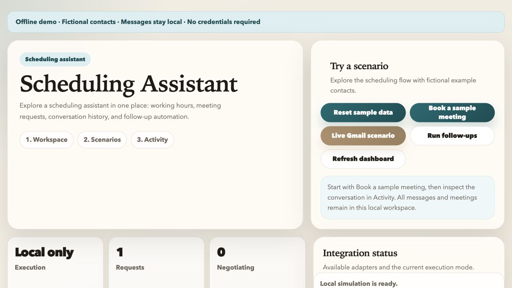

# Scheduling Assistant

[](https://github.com/pol4xer/assistant_prod/actions/workflows/ci.yml)

A local scheduling workbench that turns meeting requests and email replies into
proposed time slots, confirmations, rescheduling, and follow-ups. A FastAPI
backend stores the workflow in SQLite and exposes an English dashboard.

**Status:** portfolio prototype. The default offline demo uses fictional contacts
and records messages locally. It does not send email, access Google accounts, or
call OpenAI. Live provider code is included, but was not verified against external
services during this refresh.



[View the confirmed-meeting example](docs/images/assistant-activity.jpg).

## Try the demo

Use Python 3.12 or 3.13 and Poetry 2:

```bash
git clone https://github.com/pol4xer/assistant_prod.git
cd assistant_prod
poetry install
make run
```

Open [127.0.0.1:8000](http://127.0.0.1:8000):

1. Inspect the fictional workspace in **1. Workspace**.
2. Open **2. Scenarios** and select **Book a sample meeting**.
3. Open **3. Activity** to inspect the request, proposed options, local messages,
   and confirmed meeting.

**Reset sample data** restores the fictional workspace. **Run follow-ups**
processes due local reminders; it may do nothing when none are due. Messages
marked **Local only** have not been sent. The live Gmail scenario and provider
connection actions remain disabled in demo mode.

No `.env` file or credentials are needed. Installation downloads dependencies;
the demo itself runs locally. State and logs are created under the ignored
`var/` directory.

## Implemented workflow

- Create an outgoing request or ingest a sample incoming email, including a
  thread with the assistant in Cc.
- Analyze intent, duration, priority, and requested dates with the local parser.
- Rank candidate slots using the workspace timezone, working hours, busy slots,
  meeting buffers, minimum notice, and location preferences.
- Accept an option, reschedule, cancel, or flag a request that needs more input.
- Persist participants, message history, options, meetings, and reminder timing.

Optional adapters implement Gmail message handling, Google Calendar events and
Meet links, Google OAuth, and an OpenAI analysis overlay. They require a separate,
explicit live configuration; see [setup](docs/SETUP.md).

## Engineering highlights

| Area | Implementation |
| --- | --- |
| Application structure | FastAPI factory with separate request, messaging, calendar, integration, demo, and automation modules |
| Scheduling | Timezone-aware slot generation, conflict checks, ranked options, and configurable follow-up timing |
| Email workflow | Thread matching, duplicate external-message detection, To/Cc recipient filtering, and explicit delivery status |
| Persistence | SQLite workflow state and local encrypted provider configuration for optional live runs |
| Observability | Request IDs, rotating logs, task status, and dashboard activity history |
| Verification | Offline scenario tests, fake provider boundaries, Ruff, a Poetry lockfile, and local Docker Compose |

Start with [`app/main.py`](app/main.py),
[`scheduler.py`](app/services/scheduler.py), and
[`requests/service.py`](app/modules/requests/service.py).
Read the [architecture](docs/ARCHITECTURE.md) and
[consolidation notes](docs/CONSOLIDATION.md) for design decisions.

## Development

```bash
make check
```

This validates metadata and the lockfile, runs Ruff and pytest, and checks the
dashboard JavaScript syntax. Node.js is required for the JavaScript check.
[Development notes](docs/DEVELOPMENT.md) cover commands and Docker usage.

## Current boundaries

This is a single-workspace local dashboard without user authentication. It has
no durable outbox, distributed workers, automatic delivery retries, or production
scale claims. Background polling is disabled by default and always disabled in
demo mode.

Live Gmail sync reads at most 25 messages per call; calendar sync reads at most
250 events per calendar call. Full pagination is not implemented. Zoom and Maps
integrations are not implemented; travel time is a local estimate, and the demo
does not invent meeting links.
