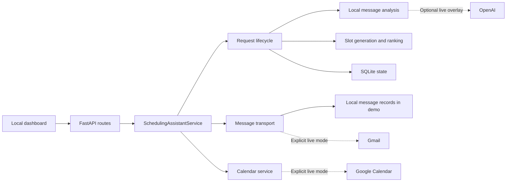

# Architecture

The FastAPI application factory creates a SQLite database and a
`SchedulingAssistantService`. The service coordinates modules for request
lifecycle, messaging, calendars, provider configuration, demonstrations, and
background automation.

## Code map

| Location | Responsibility |
| --- | --- |
| `app/main.py` | Factory, HTTP routes, lifespan, request IDs, and static assets |
| `app/core/config.py` | Environment and `.env` settings, including demo mode |
| `app/core/db.py` | SQLite schema, workflow records, and queries |
| `app/services/assistant.py` | Application coordination and workspace defaults |
| `app/services/analysis.py` | Local intent, time, duration, and priority extraction |
| `app/services/scheduler.py` | Availability checks, candidate ranking, and reminder timing |
| `app/modules/requests/` | Request creation, acceptance, rescheduling, and cancellation |
| `app/modules/messaging/` | Message records, Gmail transport, threading, and inbox filtering |
| `app/modules/calendar/` | Google Calendar synchronization and event handling |
| `app/modules/integrations/` | Provider settings and OAuth lifecycle |
| `app/modules/demo/` | Repeatable fictional scheduling scenarios |
| `app/modules/automation/` | Optional polling loop and manual automation cycles |
| `app/services/dashboard.py`, `app/static/` | Dashboard HTML, JavaScript, and styles |

Small compatibility modules under `app/services/` re-export some implementations
from `app/modules/`. The application service still coordinates substantial shared
state; the project does not claim complete separation into independent services.

## Scheduling and request state

The local analyzer extracts scheduling hints from message text. An optional
OpenAI overlay can supply normalized fields in a live configuration. The
scheduler combines requested windows with weekly availability, rejects busy or
insufficient-notice slots, includes meeting buffers, and ranks the remaining
options. All scheduling uses timezone-aware datetimes.

Request statuses include `draft`, `negotiating`, `confirmed`, `cancelled`, and
`needs_input`. Reply handling can select a proposed option, request another
window, or cancel a meeting. SQLite stores request details, participants, emails,
options, meetings, and reminder due times. External message identifiers support
duplicate detection when an already-seen email is ingested again.

New Gmail threads must include the configured assistant address in To or Cc.
Replies to an existing request keep their thread association. This recipient
check complements the scheduling-relevance filter; it does not make the system
a general mailbox agent.

## Offline and live boundaries

`APP_DEMO_MODE=true` is the default. Demo scenarios call the actual request and
scheduling code with fictional contacts and simulated incoming replies. Outgoing
messages are stored with local delivery status, without invoking Gmail. Google
OAuth, credential saving, calendar synchronization, and OpenAI network calls are
gated at the service/provider boundary as well as disabled in the dashboard.

The secret vault is initialized only when a live configuration needs it. Optional
provider credentials are encrypted in local storage using a separate key. The
local database and key are runtime files, not repository content.

Live delivery status distinguishes `pending`, `sent`, and `failed`. Legacy automation
counters named `follow_ups_sent` and `confirmations_sent` count generated records;
use each message's `delivery_status` to determine actual delivery. These records
are not a transactional outbox: there is no separate durable dispatcher or
automatic failed-message retry queue. A local workflow record is not proof of
external email delivery or calendar creation.

## Automation and limits

Manual automation cycles process due follow-ups and confirmations. An optional
async polling loop runs blocking service work in a thread. Polling requires
explicit live configuration and is forcibly disabled in demo mode. Locks and
runtime counters belong to one application process.

Gmail reads up to 25 messages and calendar synchronization up to 250 events per
calendar call; there is no complete pagination loop. Meet URLs come from a real
calendar response when available. Zoom creation and Maps routing are absent;
travel estimates use local coordinates and heuristics.

The tests establish local workflow behavior with temporary databases and fake
provider responses. They do not establish live provider compatibility,
production concurrency, or complete mailbox/calendar coverage.
